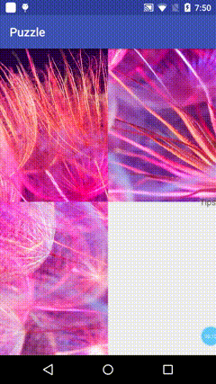

# floatingeditor
Android puzzle game.

 简单的安卓拼图游戏，内部滑动通过ViewDragHelper实现。
 Simple Android puzzle game, internal sliding through ViewDragHelper implementation.

## 预览 Preview

License
--------

    Copyright 2017 kevin.

    Licensed under the Apache License, Version 2.0 (the "License");
    you may not use this file except in compliance with the License.
    You may obtain a copy of the License at

       http://www.apache.org/licenses/LICENSE-2.0

    Unless required by applicable law or agreed to in writing, software
    distributed under the License is distributed on an "AS IS" BASIS,
    WITHOUT WARRANTIES OR CONDITIONS OF ANY KIND, either express or implied.
    See the License for the specific language governing permissions and
    limitations under the License.
